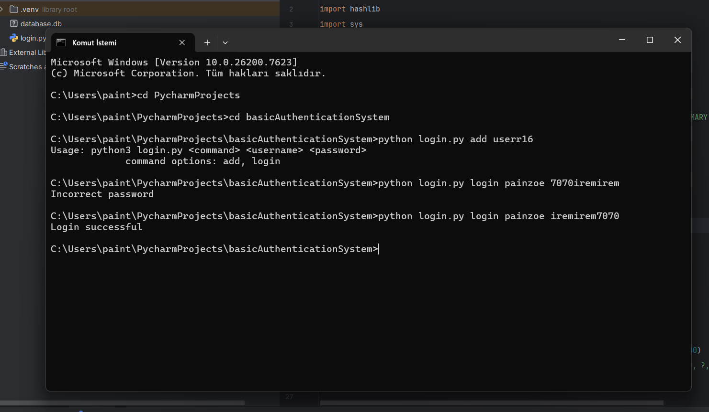

# 🔐 Simple Python Authentication System

A lightweight Python project demonstrating secure password storage and verification using **SQLite** and **cryptographic hashing**.

---

## Features

- Add new users with **secure password hashing** (`PBKDF2-HMAC-SHA256`)  
- Login verification with **constant-time comparison** to prevent timing attacks  
- Unique salts for each user for enhanced security  
- All data stored locally in **SQLite database**  

---

## Usage

```bash
# Add a new user
python3 login.py add <username> <password>

# Login with existing user
python3 login.py login <username> <password>
``` 
Example;
 

